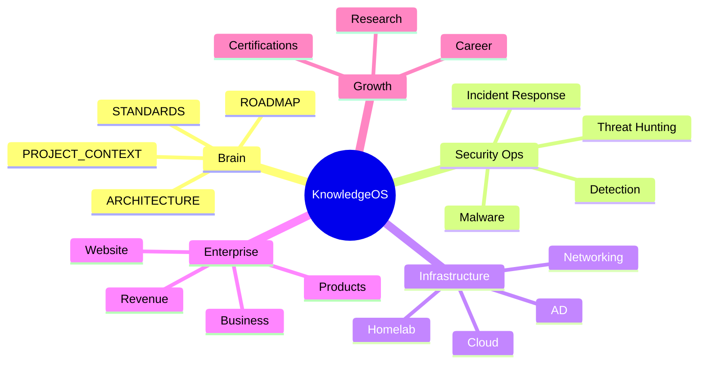

# ElliottSecurity KnowledgeOS

> [!summary] Mission Pulse
> Single source of truth for ElliottSecurity operations, research, career growth, and business execution.

## Navigate

## Canonical Brain

- [[PROJECT_CONTEXT]]
- [[ARCHITECTURE]]
- [[STANDARDS]]
- [[ROADMAP]]

## Operations

- [[Homelab Overview]]
- [[Networking Overview]]
- [[Infrastructure Overview]]
- [[Detection Engineering Overview]]
- [[Threat Hunting Overview]]
- [[Incident Response Overview]]

## Enterprise

- [[Business Overview]]
- [[Platform Overview]]
- [[Website Overview]]
- [[Products Overview]]
- [[Marketing Overview]]
- [[Revenue Overview]]

## Growth

- [[Career Overview]]
- [[Certifications Overview]]
- [[Research Overview]]
- [[Programming Overview]]

## Working Surfaces

- [[KnowledgeOS Dashboards]]
- [[Templates Index]]
- [[Daily Notes Overview]]
- [[Automation Overview]]
- [[Archive Overview]]
