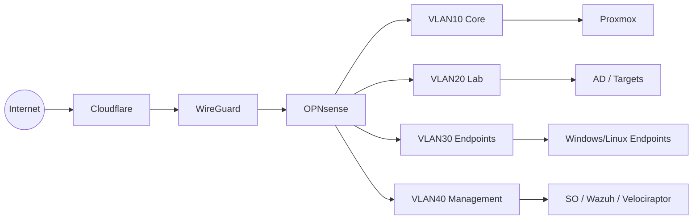

# Network Diagram

> [!summary] Summary
> Canonical logical network diagram for the environment.

Update VLAN numbers when physical truth is confirmed.

## Related Notes

- [[Networking Overview]]
- [[OPNsense Overview]]
- [[ARCHITECTURE]]

## TODOs

- [ ] Expand this note with operational detail

---

**KnowledgeOS** · ElliottSecurity Internal · [[PROJECT_CONTEXT]] · [[ARCHITECTURE]] · [[STANDARDS]] · [[ROADMAP]]
