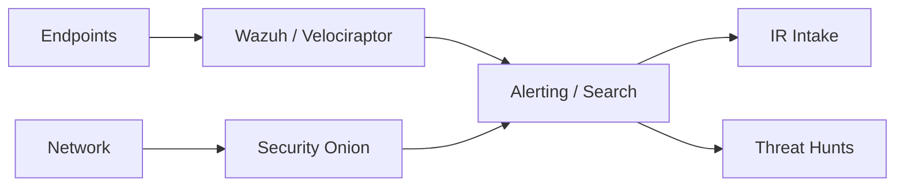

# Monitoring Overview

> [!summary] Summary
> Availability and security monitoring map.

## Related Notes

- [[Security Onion Overview]]
- [[Wazuh Overview]]
- [[Velociraptor Overview]]

## TODOs

- [ ] Expand this note with operational detail

---

**KnowledgeOS** · ElliottSecurity Internal · [[PROJECT_CONTEXT]] · [[ARCHITECTURE]] · [[STANDARDS]] · [[ROADMAP]]
