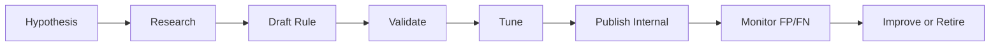

# Detection Lifecycle

> [!summary] Summary
> From hypothesis to production-quality detection.

## Related Notes

- [[Detection Engineering Overview]]
- [[Detection Quality Bar]]
- [[Detections Index]]

## TODOs

- [ ] Expand this note with operational detail

---

**KnowledgeOS** · ElliottSecurity Internal · [[PROJECT_CONTEXT]] · [[ARCHITECTURE]] · [[STANDARDS]] · [[ROADMAP]]
