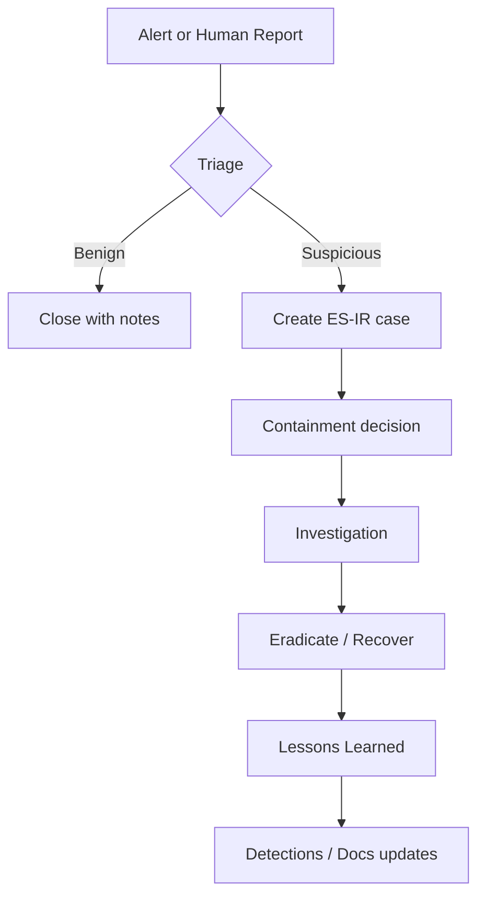

# IR Intake Process

> [!summary] Summary
> How alerts and suspicions become IR cases.

## Related Notes

- [[IR Doctrine]]
- [[Cases Index]]
- [[Playbooks Index]]

## TODOs

- [ ] Expand this note with operational detail

---

**KnowledgeOS** · ElliottSecurity Internal · [[PROJECT_CONTEXT]] · [[ARCHITECTURE]] · [[STANDARDS]] · [[ROADMAP]]
