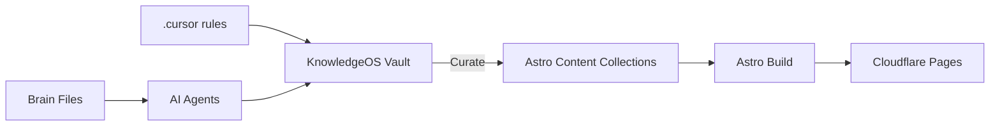

# Platform Architecture

> [!summary] Summary
> How KnowledgeOS and the public platform relate.

## Related Notes

- [[Platform Overview]]
- [[Website Overview]]
- [[PROJECT_CONTEXT]]

## TODOs

- [ ] Expand this note with operational detail

---

**KnowledgeOS** · ElliottSecurity Internal · [[PROJECT_CONTEXT]] · [[ARCHITECTURE]] · [[STANDARDS]] · [[ROADMAP]]
