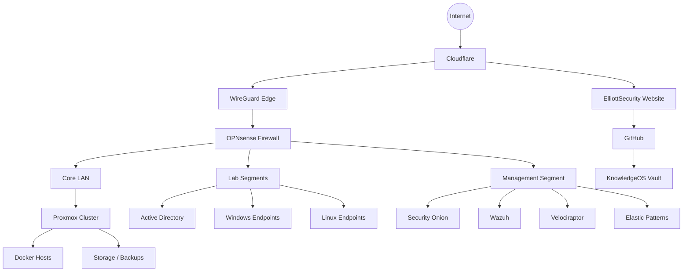

# ARCHITECTURE

> [!info] Living Architecture Document
> Describes the ElliottSecurity environment as documented in KnowledgeOS. Update when topology, tooling, or trust boundaries change.

## Architecture Overview

ElliottSecurity operates a layered homelab and knowledge platform designed to resemble a small-enterprise security environment.

## Trust Boundaries

| Zone | Purpose | Notes |
| --- | --- | --- |
| Edge | Internet exposure, VPN, reverse proxy patterns | Cloudflare + OPNsense + WireGuard |
| Core | Stable services and shared infrastructure | Proxmox hosts, DNS, storage |
| Lab | Attack/defense experimentation | AD, vulnerable and hardened targets |
| Management | Security tooling and monitoring | SO, Wazuh, Velociraptor, Elastic |
| Knowledge | Documentation and publishing | KnowledgeOS + website repo |

## Proxmox

Proxmox VE is the virtualization backbone. Document host inventory, VM/LXC naming, storage pools, backup jobs, snapshot policy, and network bridges.

See [[Proxmox Overview]] and [[Homelab Overview]].

## OPNsense

OPNsense provides routing, firewalling, DHCP/DNS patterns, and segmentation. Prioritize interface/VLAN maps, aliases, rule groups, and logging for detection feeds.

See [[OPNsense Overview]] and [[Network Segmentation]].

## WireGuard

WireGuard provides secure remote access. Document peer inventory (no private keys), AllowedIPs design, tunnel mode decisions, and break-glass access.

See [[WireGuard Overview]] and [[VPN Access Runbook]].

## Cloudflare

Cloudflare fronts public publishing and DNS, including Cloudflare Pages for the Astro site. Document DNS zones, Pages mapping, Access experiments, and WAF/caching decisions.

See [[Cloudflare Overview]] and [[Website Overview]].

## Active Directory

AD is a first-class lab domain for enterprise defense practice: forest/domain design, OU strategy, privileged access model, GPO baselines, and attack-path hypotheses with detections.

See [[Active Directory Overview]] and [[AD Attack Paths]].

## Windows

Windows Server and client estate for identity/GPO labs, endpoint telemetry, detection validation, and IR evidence drills.

See [[Windows Estate Overview]].

## Linux

Linux systems support infrastructure services, containers, collectors, and hardening labs.

See [[Linux Estate Overview]].

## Docker

Docker hosts package monitoring, utility, and application services. Compose-first, pin versions, no undocumented privileged containers.

See [[Docker Overview]].

## Security Onion

Network detection and visibility platform. Document sensor placement, visibility gaps, and investigation workflows.

See [[Security Onion Overview]].

## Velociraptor

Endpoint visibility, triage, and hunt-style collection. Document topology, IR artifacts, and access/audit expectations.

See [[Velociraptor Overview]].

## Wazuh

XDR/SIEM-style alerting and compliance signals. Document agent coverage, rule customization, and alert triage into IR.

See [[Wazuh Overview]].

## Elastic

Elastic patterns support search, dashboards, and detection development. Document index naming, retention intent, and validation workflows.

See [[Elastic Overview]].

## Networking

Networking docs must answer: What can talk to what? What is logged? What is the blast radius of compromise?

See [[Networking Overview]] and [[Network Diagram]].

## Storage

Storage covers Proxmox pools, backup targets, and retention.

See [[Storage and Backups]].

## VPN

VPN access is identity-adjacent. Pair with device hygiene and least privilege.

See [[WireGuard Overview]].

## Monitoring

Monitoring spans availability, security telemetry, and knowledge-process health.

See [[Monitoring Overview]] and [[KnowledgeOS Dashboards]].

## Future Infrastructure

- Dedicated detection-as-code CI
- Immutable logging target
- Purple-team range VLAN
- Cloud account lab (AWS/Azure/GCP lightweight)
- Secrets management pattern (external to Git)

## Infrastructure Roadmap

| Phase | Focus | Status |
| --- | --- | --- |
| 0 | KnowledgeOS architecture docs | In progress |
| 1 | Accurate network + Proxmox inventory | Planned |
| 2 | AD + endpoint telemetry baseline | Planned |
| 3 | SO / Wazuh / Velociraptor runbooks | Planned |
| 4 | Detection validation loop | Planned |
| 5 | Cloud + automation expansion | Backlog |

Track execution in [[ROADMAP]].

## Related Notes

- [[PROJECT_CONTEXT]]
- [[STANDARDS]]
- [[Homelab Overview]]
- [[Infrastructure Overview]]
- [[Networking Overview]]
