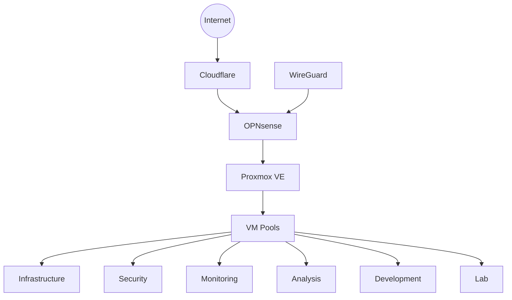

---
# GENERATED FILE — do not hand-edit dashboard fields.
# Source: elliottsecurity-knowledgebase/Status/public-lab-status.yaml
# Regenerate: python3 scripts/sync_lab_status.py --website-repo ../elliottsecurity-website
title: "Lab Progress"
description: "Public progress tracker for the ElliottSecurity Enterprise Homelab — milestones, roadmap, and what is being built now."
slug: lab-status
pageTitle: "Lab Progress"
eyebrow: "Now Building"
overallProgress: 5
currentMilestone: "DCP-001"
currentPhase: "Foundation"
nextObjective: "DCP-002 — Golden Templates (Ubuntu, Windows Server, Windows 11)"
nextMilestone: "DCP-002"
currentFocus: "Hardening the Proxmox foundation and preparing golden VM templates for Ubuntu, Windows Server, and Windows 11."
lastUpdated: 2026-07-19
draft: false
featured: true
tags:
  - homelab
  - status
  - lab-progress
  - dcp
timeline:
  - date: "2026-07-19"
    label: "DCP-001 completed — Proxmox foundation"
  - date: "TBD"
    label: "DCP-002 — Golden templates"
  - date: "TBD"
    label: "DCP-003 — Core networking and segmentation"
completedMilestones:
  - id: DCP-001
    title: "Proxmox Foundation"
    summary: "Installed and hardened Proxmox VE, created backup administrator accounts, disabled root GUI login, and established enterprise VM pools."
    completed: "2026-07-19"
upcomingMilestones:
  - id: DCP-002
    title: "Golden Templates"
    summary: "Build reusable Ubuntu, Windows Server, and Windows 11 templates."
  - id: DCP-003
    title: "Core Networking"
    summary: "Deploy OPNsense, VLAN segmentation, and lab routing foundations."
  - id: DCP-004
    title: "Identity Baseline"
    summary: "Stand up Active Directory and privileged access patterns."
  - id: DCP-005
    title: "Telemetry Platform"
    summary: "Deploy Elastic Security / log pipeline for detection engineering."
roadmap:
  - phase: "Foundation"
    status: "in-progress"
    progress: 60
    items:
      - "Proxmox VE host install and hardening"
      - "Enterprise VM pool structure"
      - "Golden OS templates"
  - phase: "Infrastructure"
    status: "planned"
    progress: 0
    items:
      - "Storage and backup jobs"
      - "Core infrastructure VMs"
      - "Container host baseline"
  - phase: "Networking"
    status: "planned"
    progress: 0
    items:
      - "OPNsense edge firewall"
      - "VLAN segmentation"
      - "WireGuard remote access"
  - phase: "Security"
    status: "planned"
    progress: 0
    items:
      - "Active Directory"
      - "Endpoint baselines"
      - "Privileged access model"
  - phase: "Monitoring"
    status: "planned"
    progress: 0
    items:
      - "Elastic / SIEM pipeline"
      - "Host and network telemetry"
  - phase: "Detection Engineering"
    status: "planned"
    progress: 0
    items:
      - "Detection-as-code workflow"
      - "Validation lab"
  - phase: "Threat Hunting"
    status: "planned"
    progress: 0
    items:
      - "Hunt hypotheses and case studies"
  - phase: "Automation"
    status: "planned"
    progress: 0
    items:
      - "Infrastructure-as-code patterns"
      - "Repeatable provisioning"
  - phase: "Portfolio"
    status: "planned"
    progress: 0
    items:
      - "Public writeups and diagrams"
      - "Website Lab Progress sync"
recentChanges:
  - date: "2026-07-19"
    title: "DCP-001 — Proxmox foundation complete"
    detail: "Proxmox VE installed, packages updated, host hardening applied, backup admin accounts created, root GUI login disabled, VM pools created."
  - date: "2026-07-19"
    title: "Lab Status Dashboard established"
    detail: "KnowledgeOS Status/LAB_STATUS.md created as engineering source of truth with synchronized public Lab Progress page on ElliottSecurity."
recentlyCompleted:
  - "Installed Proxmox VE"
  - "Updated repositories and packages"
  - "Initial host hardening"
  - "Backup Linux / PAM / PVE administrator accounts"
  - "Disabled root login through the Proxmox Web GUI"
  - "Created enterprise VM pools"
architectureOverview: "Planned Version 1 stack: Proxmox VE hypervisor; OPNsense firewall with VLAN segmentation and WireGuard; Active Directory for identity; Elastic Security for telemetry and detection; Docker for supporting services; TrueNAS for storage/backups. Current live state is foundation-only — Proxmox host and pool structure. Remaining layers land in subsequent DCP milestones."
screenshotsPlaceholder: "Screenshots from DCP-001 (Proxmox dashboard, pool layout, hardening evidence) will be added here."
architectureDiagramPlaceholder: "Architecture diagram placeholder — export from KnowledgeOS ARCHITECTURE.md / Excalidraw when Version 1 topology is validated."
---

# Enterprise Homelab Progress

The ElliottSecurity Enterprise Homelab is a production-inspired cybersecurity lab built on Proxmox VE. Version 1 focuses on segmented networks, identity, telemetry, detection engineering, threat hunting, and incident response workflows. Foundation work (DCP-001) is complete: Proxmox is installed, repositories and packages are current, host hardening and backup admin accounts are in place, root GUI login is disabled, and enterprise VM pools are created. Next up is golden template engineering under DCP-002.

## Current Focus

Hardening the Proxmox foundation and preparing golden VM templates for Ubuntu, Windows Server, and Windows 11.

## Timeline

- **2026-07-19** — DCP-001 completed — Proxmox foundation
- **TBD** — DCP-002 — Golden templates
- **TBD** — DCP-003 — Core networking and segmentation

## Completed Milestones

- **DCP-001 — Proxmox Foundation** (2026-07-19): Installed and hardened Proxmox VE, created backup administrator accounts, disabled root GUI login, and established enterprise VM pools.

## Upcoming Milestones

- **DCP-002 — Golden Templates**: Build reusable Ubuntu, Windows Server, and Windows 11 templates.
- **DCP-003 — Core Networking**: Deploy OPNsense, VLAN segmentation, and lab routing foundations.
- **DCP-004 — Identity Baseline**: Stand up Active Directory and privileged access patterns.
- **DCP-005 — Telemetry Platform**: Deploy Elastic Security / log pipeline for detection engineering.

## Architecture Overview

Planned Version 1 stack: Proxmox VE hypervisor; OPNsense firewall with VLAN segmentation and WireGuard; Active Directory for identity; Elastic Security for telemetry and detection; Docker for supporting services; TrueNAS for storage/backups. Current live state is foundation-only — Proxmox host and pool structure. Remaining layers land in subsequent DCP milestones.

## Roadmap

### Foundation

- **Status:** in-progress
- **Progress:** 60%

  - Proxmox VE host install and hardening
  - Enterprise VM pool structure
  - Golden OS templates

### Infrastructure

- **Status:** planned
- **Progress:** 0%

  - Storage and backup jobs
  - Core infrastructure VMs
  - Container host baseline

### Networking

- **Status:** planned
- **Progress:** 0%

  - OPNsense edge firewall
  - VLAN segmentation
  - WireGuard remote access

### Security

- **Status:** planned
- **Progress:** 0%

  - Active Directory
  - Endpoint baselines
  - Privileged access model

### Monitoring

- **Status:** planned
- **Progress:** 0%

  - Elastic / SIEM pipeline
  - Host and network telemetry

### Detection Engineering

- **Status:** planned
- **Progress:** 0%

  - Detection-as-code workflow
  - Validation lab

### Threat Hunting

- **Status:** planned
- **Progress:** 0%

  - Hunt hypotheses and case studies

### Automation

- **Status:** planned
- **Progress:** 0%

  - Infrastructure-as-code patterns
  - Repeatable provisioning

### Portfolio

- **Status:** planned
- **Progress:** 0%

  - Public writeups and diagrams
  - Website Lab Progress sync

## Recent Changes

- **2026-07-19 — DCP-001 — Proxmox foundation complete**: Proxmox VE installed, packages updated, host hardening applied, backup admin accounts created, root GUI login disabled, VM pools created.
- **2026-07-19 — Lab Status Dashboard established**: KnowledgeOS Status/LAB_STATUS.md created as engineering source of truth with synchronized public Lab Progress page on ElliottSecurity.

## Recently Completed

- Installed Proxmox VE
- Updated repositories and packages
- Initial host hardening
- Backup Linux / PAM / PVE administrator accounts
- Disabled root login through the Proxmox Web GUI
- Created enterprise VM pools

## Screenshots Placeholder

> Screenshots from DCP-001 (Proxmox dashboard, pool layout, hardening evidence) will be added here.

## Architecture Diagram Placeholder

> Architecture diagram placeholder — export from KnowledgeOS ARCHITECTURE.md / Excalidraw when Version 1 topology is validated.

## Mermaid Diagram Placeholder

