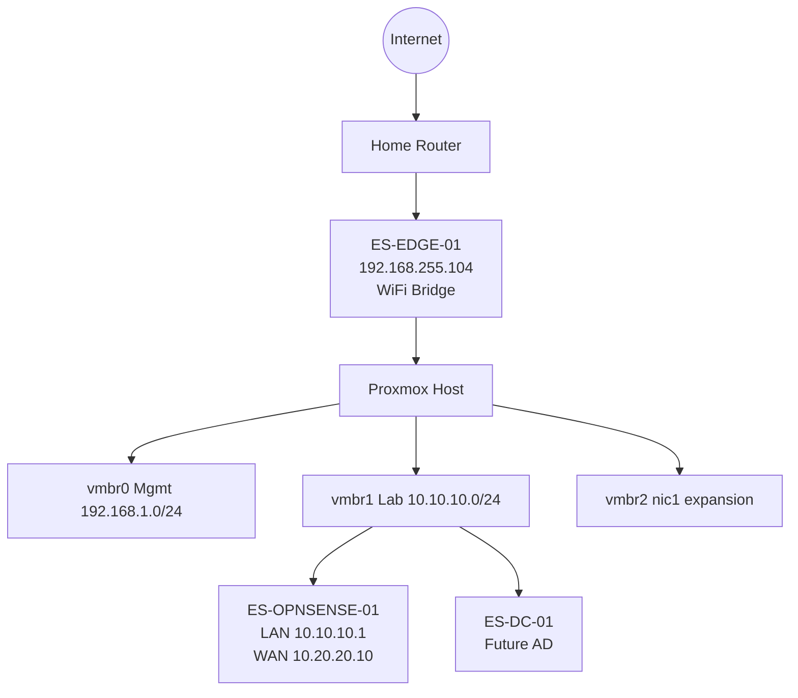

---
# GENERATED FILE — do not hand-edit dashboard fields.
# Source: elliottsecurity-knowledgebase/Status/public-lab-status.yaml
# Regenerate: python3 scripts/sync_lab_status.py --website-repo ../elliottsecurity-website
title: "Lab Progress"
description: "Public progress tracker for the ElliottSecurity Enterprise Homelab — milestones, roadmap, and what is being built now."
slug: lab-status
pageTitle: "Lab Progress"
eyebrow: "Now Building"
overallProgress: 15
currentMilestone: "DCP-002"
currentPhase: "Networking"
nextObjective: "DCP-003 — Identity Baseline (Windows Server + Active Directory on ES-DC-01)"
nextMilestone: "DCP-003"
currentFocus: "Active Directory is in progress on ES-DC-01. Networking foundation is online: WiFi edge bridge, OPNsense, Proxmox bridges, and the internal lab network."
lastUpdated: 2026-07-20
draft: false
featured: true
tags:
  - homelab
  - status
  - lab-progress
  - dcp
progressFlags:
  - name: "WiFi Bridge"
    status: "complete"
  - name: "OPNsense"
    status: "complete"
  - name: "Internal Networking"
    status: "complete"
  - name: "Infrastructure Foundation"
    status: "complete"
  - name: "Active Directory"
    status: "in-progress"
timeline:
  - date: "2026-07-20"
    label: "DCP-002 — OPNsense, WiFi bridge, Proxmox networking, ES-DC-01"
  - date: "2026-07-19"
    label: "DCP-001 completed — Proxmox foundation"
  - date: "TBD"
    label: "DCP-003 — Identity baseline (AD on ES-DC-01)"
  - date: "TBD"
    label: "DCP-004 — Golden templates"
completedMilestones:
  - id: DCP-001
    title: "Proxmox Foundation"
    summary: "Installed and hardened Proxmox VE, created backup administrator accounts, disabled root GUI login, and established enterprise VM pools."
    completed: "2026-07-19"
  - id: DCP-002
    title: "Networking & Edge Foundation"
    summary: "Built ES-EDGE-01 WiFi bridge, installed OPNsense with validated WAN/LAN, configured Proxmox bridges, uploaded ISOs, and created ES-DC-01."
    completed: "2026-07-20"
upcomingMilestones:
  - id: DCP-003
    title: "Identity Baseline"
    summary: "Install Windows Server and Active Directory roles on ES-DC-01."
  - id: DCP-004
    title: "Golden Templates"
    summary: "Build reusable Ubuntu, Windows Server, and Windows 11 templates."
  - id: DCP-005
    title: "Telemetry Platform"
    summary: "Deploy Elastic Security / log pipeline for detection engineering."
roadmap:
  - phase: "Foundation"
    status: "in-progress"
    progress: 85
    items:
      - "Proxmox VE host install and hardening"
      - "Enterprise VM pool structure"
      - "ISO library uploaded"
      - "Golden OS templates (remaining)"
  - phase: "Infrastructure"
    status: "in-progress"
    progress: 25
    items:
      - "Infrastructure inventory established"
      - "ES-DC-01 VM created"
      - "Windows / AD install pending"
  - phase: "Networking"
    status: "in-progress"
    progress: 45
    items:
      - "ES-EDGE-01 WiFi bridge"
      - "OPNsense LAN/WAN online"
      - "Proxmox vmbr0 / vmbr1 / vmbr2"
      - "WireGuard and extra VLANs (remaining)"
  - phase: "Security"
    status: "in-progress"
    progress: 10
    items:
      - "OPNsense security boundary"
      - "Active Directory in progress"
      - "Endpoint baselines"
  - phase: "Monitoring"
    status: "planned"
    progress: 0
    items:
      - "Elastic / SIEM pipeline"
      - "Host and network telemetry"
  - phase: "Detection Engineering"
    status: "planned"
    progress: 0
    items:
      - "Detection-as-code workflow"
      - "Validation lab"
  - phase: "Threat Hunting"
    status: "planned"
    progress: 0
    items:
      - "Hunt hypotheses and case studies"
  - phase: "Automation"
    status: "planned"
    progress: 5
    items:
      - "Status sync automation"
      - "Infrastructure-as-code patterns"
  - phase: "Portfolio"
    status: "in-progress"
    progress: 25
    items:
      - "Lab Progress sync"
      - "Public infrastructure inventory"
      - "Screenshots and diagram assets"
recentChanges:
  - date: "2026-07-20"
    title: "DCP-002 — Networking & edge foundation"
    detail: "Installed OPNsense, built Raspberry Pi WiFi bridge, configured Proxmox networking bridges, created Domain Controller VM, uploaded ISOs."
  - date: "2026-07-19"
    title: "DCP-001 — Proxmox foundation complete"
    detail: "Proxmox VE installed, packages updated, host hardening applied, backup admin accounts created, root GUI login disabled, VM pools created."
  - date: "2026-07-19"
    title: "Lab Status Dashboard established"
    detail: "KnowledgeOS Status/LAB_STATUS.md created as engineering source of truth with synchronized public Lab Progress page on ElliottSecurity."
recentlyCompleted:
  - "Installed OPNsense (ES-OPNSENSE-01)"
  - "Built Raspberry Pi WiFi bridge (ES-EDGE-01)"
  - "Configured Proxmox networking (vmbr0 / vmbr1 / vmbr2)"
  - "Created Domain Controller VM (ES-DC-01)"
  - "Created internal lab network 10.10.10.0/24"
  - "Uploaded required VM ISO images"
infrastructureInventory:
  - name: "ES-EDGE-01"
    role: "WiFi-to-Ethernet edge bridge"
    status: "Active"
    detail: "Ubuntu Server Raspberry Pi at 192.168.255.104 providing upstream WiFi connectivity so Proxmox/lab can operate without a dedicated Ethernet drop."
  - name: "ES-OPNSENSE-01"
    role: "Lab firewall and router"
    status: "Installed"
    detail: "Network pool VM with boot on startup. LAN 10.10.10.1/24, WAN 10.20.20.10/24. Connectivity validated to 10.20.20.2, 1.1.1.1, and google.com."
  - name: "ES-DC-01"
    role: "Future Active Directory domain controller"
    status: "Created"
    detail: "Infrastructure pool VM attached to vmbr1. Windows install and AD / DNS / DHCP / Group Policy / Certificate Services are still pending."
architectureOverview: "Live path: Internet → Home Router → ES-EDGE-01 (WiFi bridge) → Proxmox Host → vmbr0 management (192.168.1.0/24), vmbr1 internal lab (10.10.10.0/24), vmbr2 nic1 expansion. ES-OPNSENSE-01 routes LAN 10.10.10.1 and WAN transit 10.20.20.10. ES-DC-01 sits on vmbr1 awaiting Windows/AD installation."
screenshotsPlaceholder: "Screenshots pending for OPNsense interfaces, Proxmox bridges, ES-EDGE-01, and ES-DC-01 hardware view."
architectureDiagramPlaceholder: "Architecture diagram placeholder — live Mermaid topology is published below; static export assets TBD."
---

# Enterprise Homelab Progress

The ElliottSecurity Enterprise Homelab is a production-inspired cybersecurity lab on Proxmox VE. DCP-001 delivered the hardened hypervisor foundation. DCP-002 delivered networking and edge foundation: Raspberry Pi WiFi bridge (ES-EDGE-01), OPNsense firewall/router (ES-OPNSENSE-01), Proxmox management and lab bridges, uploaded installation ISOs, and the Domain Controller VM shell (ES-DC-01). Active Directory installation is the current in-progress work.

## Current Focus

Active Directory is in progress on ES-DC-01. Networking foundation is online: WiFi edge bridge, OPNsense, Proxmox bridges, and the internal lab network.

## Progress Indicators

- **WiFi Bridge** — complete
- **OPNsense** — complete
- **Internal Networking** — complete
- **Infrastructure Foundation** — complete
- **Active Directory** — in progress

## Timeline

- **2026-07-20** — DCP-002 — OPNsense, WiFi bridge, Proxmox networking, ES-DC-01
- **2026-07-19** — DCP-001 completed — Proxmox foundation
- **TBD** — DCP-003 — Identity baseline (AD on ES-DC-01)
- **TBD** — DCP-004 — Golden templates

## Completed Milestones

- **DCP-001 — Proxmox Foundation** (2026-07-19): Installed and hardened Proxmox VE, created backup administrator accounts, disabled root GUI login, and established enterprise VM pools.
- **DCP-002 — Networking & Edge Foundation** (2026-07-20): Built ES-EDGE-01 WiFi bridge, installed OPNsense with validated WAN/LAN, configured Proxmox bridges, uploaded ISOs, and created ES-DC-01.

## Upcoming Milestones

- **DCP-003 — Identity Baseline**: Install Windows Server and Active Directory roles on ES-DC-01.
- **DCP-004 — Golden Templates**: Build reusable Ubuntu, Windows Server, and Windows 11 templates.
- **DCP-005 — Telemetry Platform**: Deploy Elastic Security / log pipeline for detection engineering.

## Infrastructure Inventory

- **ES-EDGE-01** (Active): Ubuntu Server Raspberry Pi at 192.168.255.104 providing upstream WiFi connectivity so Proxmox/lab can operate without a dedicated Ethernet drop.
- **ES-OPNSENSE-01** (Installed): Network pool VM with boot on startup. LAN 10.10.10.1/24, WAN 10.20.20.10/24. Connectivity validated to 10.20.20.2, 1.1.1.1, and google.com.
- **ES-DC-01** (Created): Infrastructure pool VM attached to vmbr1. Windows install and AD / DNS / DHCP / Group Policy / Certificate Services are still pending.

## Architecture Overview

Live path: Internet → Home Router → ES-EDGE-01 (WiFi bridge) → Proxmox Host → vmbr0 management (192.168.1.0/24), vmbr1 internal lab (10.10.10.0/24), vmbr2 nic1 expansion. ES-OPNSENSE-01 routes LAN 10.10.10.1 and WAN transit 10.20.20.10. ES-DC-01 sits on vmbr1 awaiting Windows/AD installation.

## Roadmap

### Foundation

- **Status:** in-progress
- **Progress:** 85%

  - Proxmox VE host install and hardening
  - Enterprise VM pool structure
  - ISO library uploaded
  - Golden OS templates (remaining)

### Infrastructure

- **Status:** in-progress
- **Progress:** 25%

  - Infrastructure inventory established
  - ES-DC-01 VM created
  - Windows / AD install pending

### Networking

- **Status:** in-progress
- **Progress:** 45%

  - ES-EDGE-01 WiFi bridge
  - OPNsense LAN/WAN online
  - Proxmox vmbr0 / vmbr1 / vmbr2
  - WireGuard and extra VLANs (remaining)

### Security

- **Status:** in-progress
- **Progress:** 10%

  - OPNsense security boundary
  - Active Directory in progress
  - Endpoint baselines

### Monitoring

- **Status:** planned
- **Progress:** 0%

  - Elastic / SIEM pipeline
  - Host and network telemetry

### Detection Engineering

- **Status:** planned
- **Progress:** 0%

  - Detection-as-code workflow
  - Validation lab

### Threat Hunting

- **Status:** planned
- **Progress:** 0%

  - Hunt hypotheses and case studies

### Automation

- **Status:** planned
- **Progress:** 5%

  - Status sync automation
  - Infrastructure-as-code patterns

### Portfolio

- **Status:** in-progress
- **Progress:** 25%

  - Lab Progress sync
  - Public infrastructure inventory
  - Screenshots and diagram assets

## Recent Changes

- **2026-07-20 — DCP-002 — Networking & edge foundation**: Installed OPNsense, built Raspberry Pi WiFi bridge, configured Proxmox networking bridges, created Domain Controller VM, uploaded ISOs.
- **2026-07-19 — DCP-001 — Proxmox foundation complete**: Proxmox VE installed, packages updated, host hardening applied, backup admin accounts created, root GUI login disabled, VM pools created.
- **2026-07-19 — Lab Status Dashboard established**: KnowledgeOS Status/LAB_STATUS.md created as engineering source of truth with synchronized public Lab Progress page on ElliottSecurity.

## Recently Completed

- Installed OPNsense (ES-OPNSENSE-01)
- Built Raspberry Pi WiFi bridge (ES-EDGE-01)
- Configured Proxmox networking (vmbr0 / vmbr1 / vmbr2)
- Created Domain Controller VM (ES-DC-01)
- Created internal lab network 10.10.10.0/24
- Uploaded required VM ISO images

## Screenshots Placeholder

> Screenshots pending for OPNsense interfaces, Proxmox bridges, ES-EDGE-01, and ES-DC-01 hardware view.

## Architecture Diagram Placeholder

> Architecture diagram placeholder — live Mermaid topology is published below; static export assets TBD.

## Mermaid Diagram Placeholder

